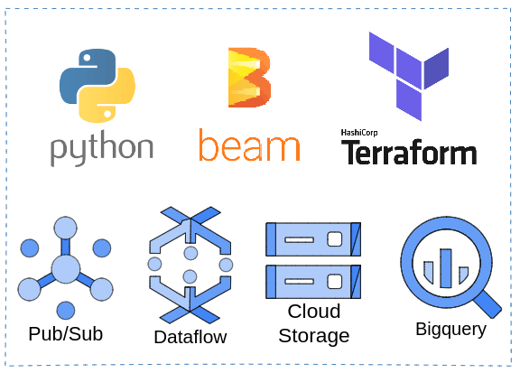
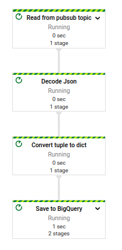
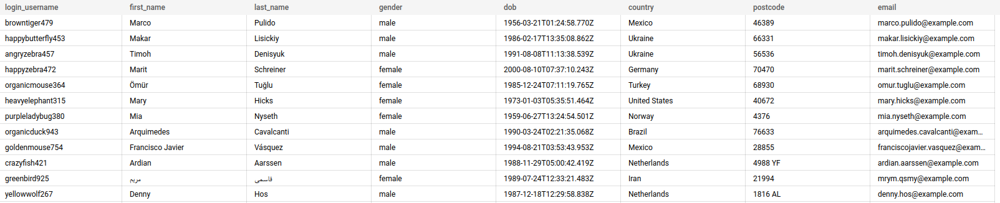
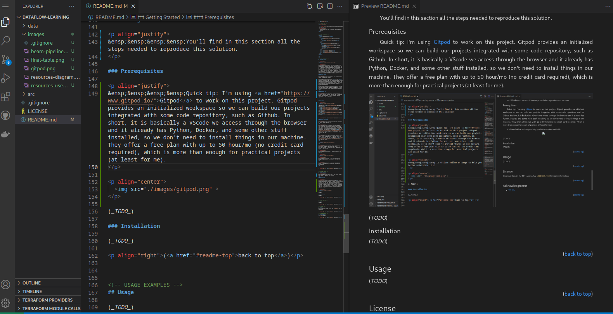

<a name="readme-top"></a>

<!-- PROJECT LOGO -->
<br />
<div align="center">

  <h3 align="center">Basic Streaming Pipeline With Apache Beam and Dataflow</h3>

  <p align="center">
    Streaming real-time data of customers registered on the website
  </p>
</div>

<br>
<p align="justify">
&ensp;&ensp;&ensp;&ensp;This repo contains a basic practical project about data pipelines using Apache Beam and some other GCP resources. This is basically a result from my studies on GCP Professional Data Engineering Certification, in which I'm looking for some practical implementations in order to be more in touch with the cloud tools and the problems they try to solve.
</p>

<p align="justify">
&ensp;&ensp;&ensp;&ensp;That's where this <a href="https://www.udemy.com/course/data-engineering-with-google-dataflow-and-apache-beam/" target="_blank">amazing couse</a> from Casio Bolba comes which I higly recommend. There we develop some basic batch and streaming pipelines using Beam and Dataflow.
</p>

<br>

<!-- TABLE OF CONTENTS -->
## Contents

<details>
  <summary>Expand</summary>
  <ol>
    <li>
      <a href="#about-the-project">About The Project</a>
      <ul>
        <li><a href="#development-plan">Development Plan</a></li>
        <li><a href="#business-context">Business Context</a></li>
        <li><a href="#built-with">Built With</a></li>
        <li><a href="#solution-description">Solution Description</a></li>
      </ul>
    </li>
    <li>
      <a href="#getting-started">Getting Started</a>
      <ul>
        <li><a href="#quick-tip">Quick Tip</a></li>
        <li><a href="#prerequisites-and-installations">Prerequisites and Installations</a></li>
        <li><a href="#reproducing">Reproducing</a></li>
      </ul>
    </li>
    <li><a href="#license">License</a></li>
    <li><a href="#acknowledgments">Acknowledgments</a></li>
  </ol>
</details>

<br>

<!-- ABOUT THE PROJECT -->
## About The Project

<p align="center">
  
</p>

<p align="justify">
&ensp;&ensp;&ensp;&ensp;Making real-time data pipelines is really very challenging, since we have to deal with data volume changing, latency, data quality, many data sources, and so on. Even though we have to keep those things in mind, when we are starting in this field we must start somewhere.

&ensp;&ensp;&ensp;&ensp;In this way, the purpose of this repo is to get in touch with some streaming capabilities of Apache Beam and Dataflow (as a runner). So, it basically consists of (fake) real-time data loading into bigquery using Pub/Sub for event data streaming and Dataflow for processing.
</p>

<p align="right">(<a href="#readme-top">back to top</a>)</p>

### Business Context

<p align="justify">
&ensp;&ensp;&ensp;&ensp;In order to be more business-like, we created a fake business context.

&ensp;&ensp;&ensp;&ensp;Our company <strong>KBS Tech</strong> has a global ecommerce website where many customers are registered every minute. Our data engineering team has already migrated historical data to a warehouse. However, the marketing and analytics teams need new customers' data to be available as soon as they are generated so they can work on products offering and customer segmentation for faster business value generation.
<br>
&ensp;&ensp;&ensp;&ensp;After some time of brainstorming, we decided to load the data through a Pub/Sub+Dataflow workload, since the company already use Google Cloud Platform in almost all of it solutions and it was the most effective solution we found.
</p>

<p align="right">(<a href="#readme-top">back to top</a>)</p>

### Development Plan

<p align="justify">
&ensp;&ensp;&ensp;&ensp;The plan was to start with a mix of on-premise and cloud resources. Here, the idea is to keep the Pub/Sub meessage producer on-premise while all the other resourcer we'll keep in the cloud.
</p>

<p align="right">(<a href="#readme-top">back to top</a>)</p>

### Built With

<p align="center">
  
</p>

- Data Source: <a href="https://randomuser.me/" target="_blank">Open Random user data API</a>
- <a href="https://www.python.org/" target="_blank">Python 3.8.16</a>
- <a href="https://beam.apache.org/" target="_blank">Apache beam</a>
- <a href="https://www.terraform.io/" target="_blank">Terraform</a>
- <a href="https://cloud.google.com/pubsub?hl=pt-br" target="_blank">Google Cloud Pub/Sub</a>
- <a href="https://cloud.google.com/dataflow?hl=pt-br" target="_blank">Google Cloud Dataflow</a>
- <a href="https://cloud.google.com/storage?hl=pt-br" target="_blank">Google Cloud Storage</a>
- <a href="https://cloud.google.com/bigquery?hl=pt-br" target="_blank">Google Bigquery</a>


<p align="right">(<a href="#readme-top">back to top</a>)</p>

### Solution Description

<p align="justify">
&ensp;&ensp;&ensp;&ensp;We'll shortelly describe the workflow so you can better understand it.
</p>

<p align="justify">
&ensp;&ensp;&ensp;&ensp;First of all, we need some data. We chose an open API that generates random user data, such as name, email, location, personal identification (according to each country). It is a good choice to simulate real-time user registration, since everytime we make a resquest, random data are returned. Once the data is gathered by a <a href="https://github.com/KattsonBastos/dataflow-learning/blob/main/src/topic_writer.py" target="_blank">Python script</a>, they are pushed into a Pub/Sub topic by the same script (which is basically an eternal loop doing that job).
</p>

<p align="justify">
&ensp;&ensp;&ensp;&ensp; On the other hand, a Dataflow Job is readily waiting for data arriving in the topic, so it can pull, transform, and load them into BigQuery. <a href="https://github.com/KattsonBastos/dataflow-learning/blob/main/src/user_streaming.py" target="_blank">The pipeline</a> has just four steps, as shows the image bellow:
</p>

<p align="center">
  
</p>

<p align="justify">
&ensp;&ensp;&ensp;&ensp;Actually, steps 2 and 3 could be just only one (we can decode the json and then return in as a dict), but, in order to explore some Beam's capabilities, we decided to separate them and use a function in the third step to convert the tuple return from the task 2 into a dict.
</p>

<p align="justify">
&ensp;&ensp;&ensp;&ensp;So, we'll end up with a table like this one:
</p>

<p align="center">
  
</p>

<p align="justify">
&ensp;&ensp;&ensp;&ensp;Just a quick note: we used cloud storage to store Dataflow's job templates and temporary building files
</p>

<p align="justify">
&ensp;&ensp;&ensp;&ensp;For provisioning all cloud resources, we used Terraform. Actually, we used mainly because we had to continuously start and stop working in this solution, so, Terraform facilitates the creationg and destruction of resources.
</p>


<p align="right">(<a href="#readme-top">back to top</a>)</p>


<!-- GETTING STARTED -->
## Getting Started

<p align="justify">
&ensp;&ensp;&ensp;&ensp;You'll find in this section all the steps needed to reproduce this solution.
</p>

### Quick tip

<p align="justify">
&ensp;&ensp;&ensp;&ensp;I'm using <a href="https://www.gitpod.io/" target="_blank">Gitpod</a> to work on this project. Gitpod provides an initialized workspace integrated with some code repository, such as Github. In short, it is basically a VScode we access through the browser and it already has Python, Docker, and some other stuff installed, so we don't need to install things in our machine. They offer a free plan with up to 50 hour/mo (no credit card required), which is more than enough for practical projects (at least for me).
</p>

<p align="center">
  
</p>

<p align="right">(<a href="#readme-top">back to top</a>)</p>

### Prerequisites and Installations

* Google Cloud Account: if you don't have one, <a href="https://k21academy.com/google-cloud/create-google-cloud-free-tier-account/" target="_blank"> here</a> you can find a nice explanation of how to create a new one with free resources for the period of 90 days
* Google Service Account and Key: we need it to authenticate to GCP. <a href="https://developers.google.com/android/management/service-account" target="_blank">Here's an official guide</a> on how to create an account and <a href="https://cloud.google.com/iam/docs/keys-create-delete#iam-service-account-keys-create-console"  target="_blank">here's</a> how to create a key. Remeber to save the key json file in your machine.
* Terraform and gcloud CLI: you can use <a href="https://github.com/KattsonBastos/dataflow-learning/blob/main/src/setup.sh"  target="_blank">this script</a> to install them if you use a Debian/Ubuntu-based system. Just run:
  ```sh
  bash setup.py
  ```
  Remember to authenticate to GCP when asked and set a project id.

<p align="right">(<a href="#readme-top">back to top</a>)</p>

### Reproducing

<p align="justify">
&ensp;&ensp;&ensp;&ensp;Before we begin, remember to take a look at following three files because they contain some variables related to GCP project ID, bucket names, and so on, that you'll need to change:
</p>

- `src/constants.py`
- `/src/infra/terraform.tfvars`
- `/src/infra/providers.tf`

1. Export env variables. In your machine, run in Terminal:
    ```sh
    export GOOGLE_PROJECT=<your_project_id>
    export GOOGLE_APPLICATION_CREDENTIALS=<path_to_your_key_json_file>
    ```

2. Clone the repo:
    ```sh
    git clone https://github.com/KattsonBastos/dataflow-learning.git
    ```

3. Create a Python's virtual environment (I'm using virtualenv for simplicity) and activate it:
    ```sh
    python3 -m virtualenv env
    source env/bin/activate
    ```

4. Install Python's packages. Access the `src` folder and run the following command:
    ```sh
    pip install -r requirements.txt
    ```

5. Create terraform backend bucket
    ```sh
    gcloud storage buckets create gs:<bucket_name> --project=<project_id> --default-storage-class=STANDARD --location=us-east1
    ```
    Remember to change the bucket name in the <a href="https://github.com/KattsonBastos/dataflow-learning/blob/main/src/infra/providers.tf" target="_blank">Terraform provers file</a> and set yours.
    You can create it through the Console, if you want.

6. Create cloud resources with Terraform: <br>
    a) First, we need to initialize terraform. Go to the `src/infra/` folder and run:
    ```sh
    terraform init
    ```
    b) Then, the following command allows us to take a look at what resources are going to be created:
    ```sh
    terraform plan
    ```
    The resources file is the `main.tf`. There, we specify we want to create a Storage Bucket, a Bigquery Dataset, and Pub/Sub Topic and Subscription. The  `force_destroy = true` in the bucket creation allows us to destroy the bucket even if it is not empty (which acceptable since this is a practical project)

    c) Actually create the resources:
    ```sh
    terraform apply
    ```
    It will ask you to confirm the resource create.

7. Create the Dataflow Job Template. Run to the `src/` folder and run the following command (`constants.py` need to be updated with your config)
    ```sh
    python3 user_streaming.py
    ```
    Once it is done, you can the template saved in the `gs://<your_bucket/template/>

8. Then, we just have to run the Dataflow using this template. You can do it in the Console, or just run the following command:
   ```sh
   gcloud dataflow jobs run <a_name_you_want> --gcs-location gs://<your_bucket_name>/template/streaming_user_bq \
   --region us-east1 --staging-location gs://<your_bucket_name>/temp/
    ```
    After some time, you'll be able to see a new table in the BQ dataset, `users`, being populated.

9. Once you finished, remember to stop the streaming pipeline, otherwise it will drain your wallet and, then, destroy all resources if you don't need them anymore:
   ```sh
   gcloud dataflow jobs cancel <job_id> --force

   terraform destroy
   ```

<p align="right">(<a href="#readme-top">back to top</a>)</p>

<!-- LICENSE -->
## License

Distributed under the MIT License. See `LICENSE.txt` for more information.

<p align="right">(<a href="#readme-top">back to top</a>)</p>


<!-- ACKNOWLEDGMENTS -->
## Acknowledgments

* <a href="https://www.linkedin.com/in/cassiobolba/" target="_blank"> Cassio Bolba</a> course on <a href="https://www.udemy.com/course/data-engineering-with-google-dataflow-and-apache-beam/" target="_blank">Data Engineering using Dataflow and Beam</a>: this course is really amazing and it will be very helpful if you want to start playing with those two tools plus BigQuery and Cloud Storage. (<a href="https://www.udemy.com/course/engenharia-de-dados-com-apache-beam-google-dataflow-gcp/" target="_blank">Portuguese course version</a>)
* <a href="https://www.linkedin.com/company/stack-tecnologias/" target="_blank">Stack Academy</a> courses on Data Pipelines with GCP and Infra as a Code: both was very enlightening about there tools.

<p align="right">(<a href="#readme-top">back to top</a>)</p>


