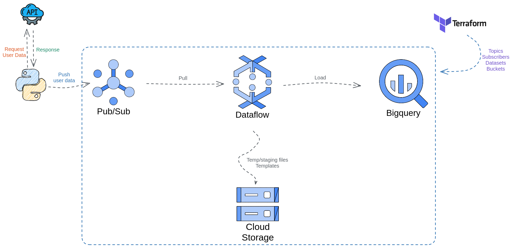

<!-- PROJECT LOGO -->
 

  <h3 align="center">Basic Streaming Pipeline With Apache Beam and Dataflow</h3>

  

    Streaming real-time data of customers registered on the website
  

<!-- TABLE OF CONTENTS -->

  
Table of Contents

  <ol>
    <li>
      <a href="#about-the-project">About The Project</a>
      <ul>
        <li><a href="#built-with">Built With</a></li>
      </ul>
    </li>
    <li>
      <a href="#getting-started">Getting Started</a>
      <ul>
        <li><a href="#prerequisites">Prerequisites</a></li>
        <li><a href="#cloud-resources">Setting Up Cloud Resourcese</a></li>
        <li><a href="#pipeline-overview">Beam Pipeline Overview</a></li>
      </ul>
    </li>
    <li><a href="#results">Results</a></li>
    <li><a href="#license">License</a></li>
    <li><a href="#contact">Contact</a></li>
    <li><a href="#acknowledgments">Acknowledgments</a></li>
  </ol>

 
 

<!-- ABOUT THE PROJECT -->
## About The Project

  

&ensp;&ensp;&ensp;&ensp;Making real-time data pipeline is really very challenging, since we have to deal with data volume changing, latency, data quality, many data source, and so on. Even though we have to keep those things in mind, when we are starting in this field, we must start somewhere.

&ensp;&ensp;&ensp;&ensp;In this way, the purpose of this repo is to get in touch with some streaming capabilities of Apache Beam and Dataflow (as a runner). So, it basically consists of (fake) real-time data loading into bigquery using Pub/Sub for event data streaming and Dataflow for processing.

### Business Context

&ensp;&ensp;&ensp;&ensp;In order to be more business-like, we created a fake business context.

&ensp;&ensp;&ensp;&ensp;Our company <strong>KB Tech</strong> has a global ecommerce website where many customers are registered every minute. The data engineering team has already migrated historical data to the data warehouse. However, the marketing and analysts teams need new customers' data to be available as soon as they are generated so they can work on products offering, customer segmentation.

_(to be continued..)_

### Built With

(_TODO_)

(<a href="#readme-top">back to top</a>)

<!-- GETTING STARTED -->
## Getting Started

(_TODO_)

### Prerequisites

(_TODO_)

### Installation

(_TODO_)

(<a href="#readme-top">back to top</a>)

<!-- USAGE EXAMPLES -->
## Usage

(_TODO_)

(<a href="#readme-top">back to top</a>)

<!-- LICENSE -->
## License

Distributed under the MIT License. See `LICENSE.txt` for more information.

(<a href="#readme-top">back to top</a>)

<!-- ACKNOWLEDGMENTS -->
## Acknowledgments

* [TO DO]((_TODO_))

(<a href="#readme-top">back to top</a>)

